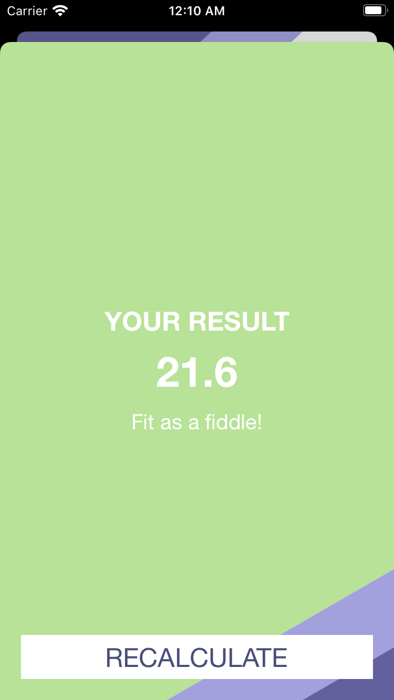
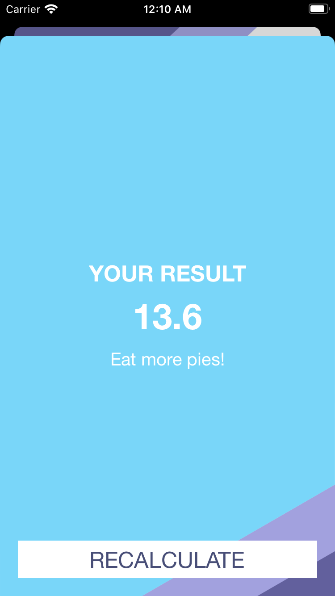

#  BMI Calculator
An iOS Application which calculates BMI.

## Technologies
- <a href="https://developer.apple.com/documentation/uikit"> UIKit </a> - Construct and manage a graphical, event-driven user interface for your iOS or tvOS app.

## Screenshots
 
  
  
 

## Credits
- <a href="https://developer.apple.com/documentation"> Apple Developer Documentation </a>
- <a href="https://www.udemy.com/course/ios-13-app-development-bootcamp/"> iOS Application Development Bootcamp </a> by Dr. Angela Yu.
